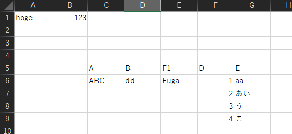

# excel2json

ExcelファイルをJSONに変換する

## Description

- ExcelをJSONに変換するAPI
- 変換の定義はYAMLで定義します
- APIはFastAPIを使ってます

## Getting Started

1. docker compose up -d
2. http://localhost:1234/docs/

## Demo

### こんな感じのExcelが



### こんな感じのYAMLの設定で

``` yaml
header:
  hoge:
    type: cell
    sheet: Sheet1
    address: B1

  fuga:
    type: cell
    sheet: Sheet1
    address: B1


items:
  type: table
  sheet: Sheet1
  address: C5
  colmap:
    - ja: A
      var: col_a

    - ja: B
      var: col_b
```

### こんな感じのJSONになる

``` json
{
  "header": {
    "hoge": 123,
    "fuga": 123
  },
  "items": [
    {
      "col_a": "ABC",
      "col_b": "dd",
      "F1": "Fuga",
      "D": 1,
      "E": "aa"
    },
    {
      "col_a": "ABC",
      "col_b": "dd",
      "F1": "Fuga",
      "D": 2,
      "E": "あい"
    },
    {
      "col_a": "ABC",
      "col_b": "dd",
      "F1": "Fuga",
      "D": 3,
      "E": "う"
    },
    {
      "col_a": "ABC",
      "col_b": "dd",
      "F1": "Fuga",
      "D": 4,
      "E": "こ"
    }
  ]
}

```